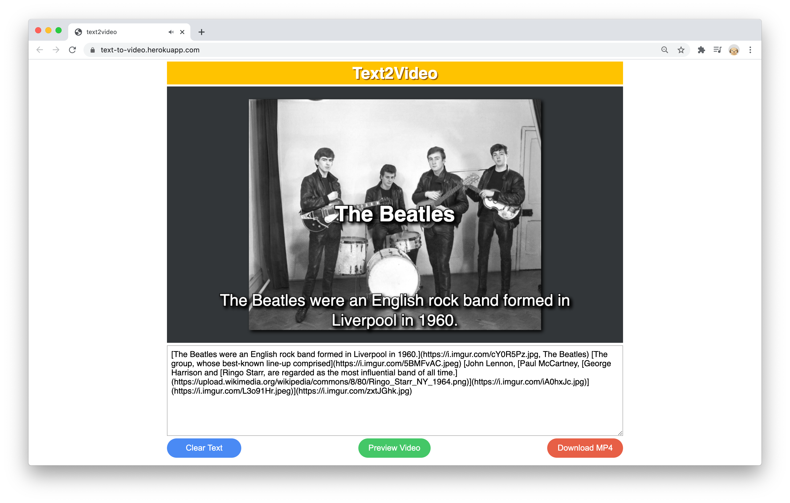

# Text2Video


## Description

**Note: This project is no longer being maintained, please check out https://github.com/cuinjune/viviify**

-------------------------------

**Text2Video** is a software tool that converts text to video for more engaging learning experience.

I started this project because during this semester, I have been given many reading assignments and I felt frustration in reading long text. For me, it was very time and energy consuming to learn something through reading. So I imagined, "What if there was a tool that turns text into something more engaging such as a video, wouldn't it improve my learning experience?"

I did some research and found a number of articles and studies supporting that videos can be more effective in learning than text for many people including the following data:

* The human brain can process visuals 60,000 times faster than text.
* Viewers retain 95% of video’s message compared to 10% when reading text.
* 65% of people consider themselves to be visual learners.

I created a prototype web application that takes text as an input and generates a video as an output.

I plan to further work on the project targeting young college students who are aged between 18 to 23 because they tend to prefer learning through videos over books based on the survey I found.

The technologies I used for the project are HTML, CSS,  Javascript, Node.js, CCapture.js,  ffmpegserver.js, Amazon Polly, Python, Flask, gevent,  spaCy, and Pixabay API.

## Setup

### Flask Server
1. Installation of Python is required.
2. Run the following commands in the Terminal.
```
git clone https://github.com/cuinjune/text2video-flask.git
cd text2video-flask
pip install -r requirements.txt
python -m spacy download en_core_web_md
touch .env
```
3. Visit [Pixabay API Documentation page](https://pixabay.com/api/docs/), login and copy your API key in the page.
4. Open the `.env` file and paste the API key like the following:
```
PIXABAY_API_AUTH_KEY=paste_your_api_key_here
```
5. Run the following commands in the Terminal.
```
python main.py
```
6. After a few seconds you should see a message `Listening on port: 3000` in the Terminal console.

### CORS Anywhere
1. Installation of Node.js is required.
2. Run the following commands in the Terminal.
```
git clone https://github.com/Rob--W/cors-anywhere.git
cd cors-anywhere
npm install
npm start
```
3. You should see a message `Running CORS Anywhere on 0.0.0.0:8080` in the Terminal console.

### Text2Video
1. Installation of Node.js is required.
2. Run the following commands in the Terminal.
```
git clone https://github.com/cuinjune/text2video.git
cd text2video
npm install
touch .env
```
3. Visit http://aws.amazon.com/ and create your credentials for Amazon Polly and paste them to `.env` like the following:
```
AWS_REGION=paste_your_aws_region
AWS_ACCESS_KEY_ID=paste_your_access_key_id
AWS_SECRET_ACCESS_KEY=paste_your_secret_access_key
```
4. Run the following commands in the Terminal.
```
npm start
```
5. Open your web browser and navigate to http://localhost:8000

## Source Code
* Client & Node.js server (Javascript): https://github.com/cuinjune/text2video
* Flask server (Python): https://github.com/cuinjune/text2video-flask

## Author
* [Zack Lee](https://www.cuinjune.com/about): MPS Candidate at [NYU ITP](https://itp.nyu.edu).
